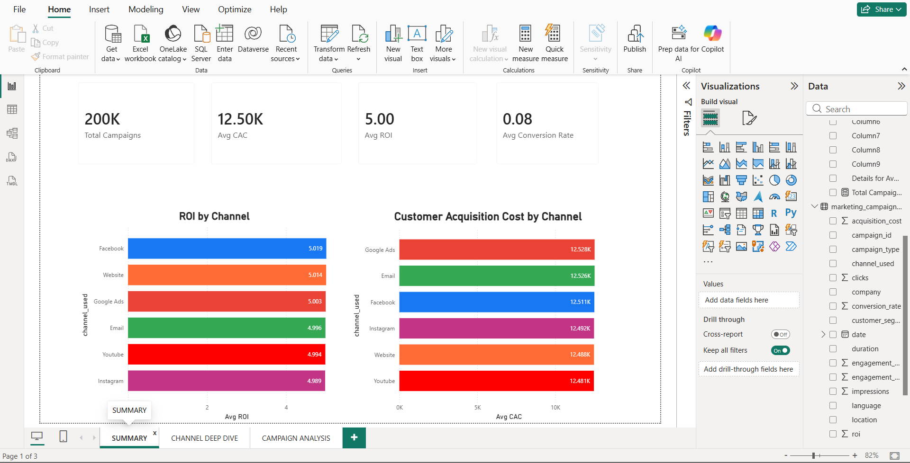
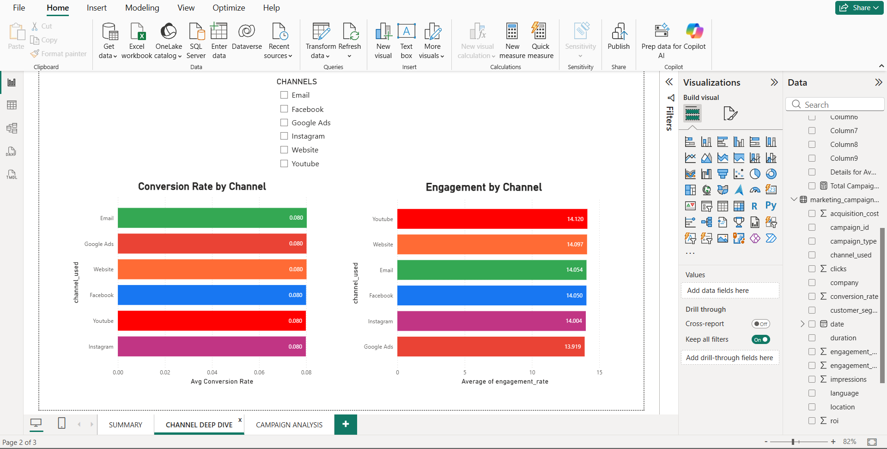
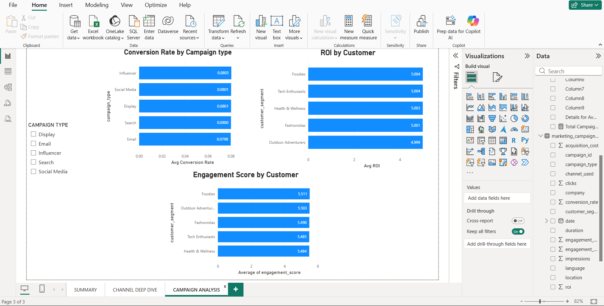

---
Marketing Campaign Performance Analysis
---
Project Overview
End-to-end data analytics project analyzing 200,000 marketing campaign records across 6 channels to evaluate ROI, Customer Acquisition Cost (CAC), conversion rates, and engagement performance. The goal was to identify the highest-performing channels and provide data-driven recommendations for budget reallocation.

Tools Used & Tool Purpose
---
Python (Pandas, NumPy)	- Data cleaning & preparation
SQL (SQLite) -	Business queries & metric calculation
Microsoft Excel -	Pivot tables & summary charts
Power BI -	Interactive dashboard

Dataset
---
Source: [dataset link] (https://www.kaggle.com/datasets/manishabhatt22/marketing-campaign-performance-dataset)
Size: 200,000 rows × 17 columns
Channels: Facebook, Website, Google Ads, Email, Instagram, YouTube
Campaign Types: Email, Influencer, Display, Search, Social Media
Date Range: 2021 — 2022

Project Structure
---
marketing-campaign-analysis/
│
├── data/
│   └── marketing_campaign_cleaned.csv    ← cleaned dataset
│
├── python/
│   └── data_cleaning.py                  ← cleaning & EDA script
│
├── sql/
│   └── analysis_queries.sql              ← 12 business queries
│
├── excel/
│   └── marketing_campaign_analysis.xlsx  ← pivot tables & charts
│
├── powerbi/
│   └── marketing_campaign_dashboard.pbix ← interactive dashboard
│
└── screenshots/
    ├── page1_executive_summary.png
    ├── page2_channel_deep_dive.png
    └── page3_campaign_analysis.png

---
Step 1 — Data Cleaning (Python)
---
Performed the following cleaning operations on the raw dataset:
Checked and confirmed zero duplicate rows and zero null values
Standardised all column names to lowercase with underscores
Standardised text values to consistent Title Case across all categorical columns
Converted percentage strings to float values where needed
Verified and retained pre-existing metrics: ROI, conversion rate, engagement rate
Exported cleaned dataset to CSV for SQL and Power BI analysis

Step 2 — SQL Analysis (12 Queries)
---
Wrote 12 business queries in SQLite covering:
Q1	Overall campaign snapshot
Q2	ROI by channel
Q3	Customer Acquisition Cost (CAC) by channel
Q4	Engagement rate by channel
Q5	Full channel performance scorecard
Q6	ROI by campaign type
Q7	ROI by customer segment
Q8	Best channel per customer segment
Q9	Performance by campaign duration
Q10	Top 2 highest-ROI channels
Q11	Monthly ROI trend over time
Q12	Location-wise performance

Step 3 — Excel Analysis
---
Built 4 pivot tables with charts:
PT1 — Average ROI by Channel
PT2 — Average CAC by Channel
PT3 — Average Conversion Rate by Campaign Type
PT4 — Average Engagement Score by Customer Segment

Step 4 — Power BI Dashboard (3 Pages)
---
Page 1 — Executive Summary
4 KPI cards: Total Campaigns (200K), Avg ROI (5.00), Avg CAC ($12,504), Avg Conversion Rate (8%)
ROI by Channel bar chart
CAC by Channel bar chart
Page 2 — Channel Deep Dive
Conversion Rate by Channel
Engagement Rate by Channel
Slicer to filter by channel interactively
Page 3 — Campaign Analysis
Conversion Rate by Campaign Type
ROI by Customer Segment
Engagement Score by Customer Segment
Slicer to filter by campaign type interactively

Key Findings
---
1. Top 2 Highest-ROI Channels
Channel	Avg ROI
Facebook	5.02
Website	5.01
2. Most Cost-Efficient Channel (Lowest CAC)
Channel	Avg CAC
YouTube	$12,481
Website	$12,488
3. Channel Performance is Balanced
All 6 channels performed very similarly in ROI (range: 4.99–5.02) and CAC (~$12,500). This indicates a well-optimised channel mix — the bigger opportunity lies in improving conversion rates and engagement rather than shifting budget between channels.
4. Recommendations
Invest more in Facebook and Website — highest ROI at 5.02 and 5.01
Scale YouTube campaigns — lowest customer acquisition cost at $12,481
Focus on conversion rate optimisation — since channel ROI is similar, improving landing pages and offers will have more impact than channel switching
---
Dashboard Screenshots
---
Page 1 — Executive Summary

Page 2 — Channel Deep Dive

Page 3 — Campaign Analysis

SQL queries:
---
Go to https://sqliteonline.com
Import `data/marketing_campaign_cleaned.csv`
Run queries from `sql/analysis_queries.sql`
Power BI dashboard:
Download Power BI Desktop (free)
Open `powerbi/marketing_campaign_dashboard.pbix`

Author
Burugu Pallavi
LinkedIn: [PallaviBurugu](https://www.linkedin.com/in/burugu-pallavi-18b462190/)
GitHub: [PallaviBurugu](https://github.com/Pallavi63)
